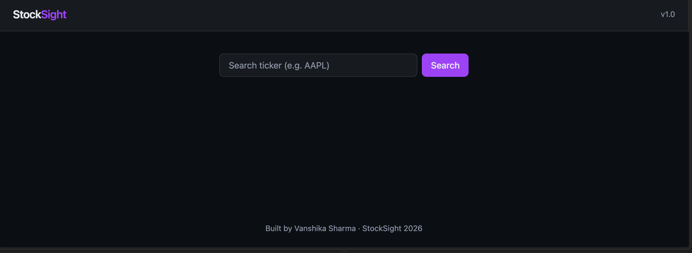

# 📈 StockSight

**A full-stack, real-time stock market dashboard built with React, TypeScript, Express, and Docker.**

Search any public ticker to view live pricing, daily change, and 30-day historical performance — rendered in a polished, dark-themed, glassmorphism interface inspired by modern finance platforms.

[Live Demo](#)

---

## 🖼️ Preview

**Home screen**


---

## 🧭 Overview

StockSight is a two-service, containerized web application that lets users search any stock ticker and instantly see:

- Current price, dollar change, and percentage change
- A 30-day historical price chart
- A clean, responsive, finance-dashboard-style UI

The project was built end-to-end — from empty repository to a Dockerized, cloud-deployed application — following professional software engineering practices: separated frontend/backend services, typed APIs, environment-based configuration, and containerized infrastructure.

---

## ✨ Features

- 🔍 **Live ticker search** — real-time quote lookup for any public stock symbol
- 📊 **Interactive historical charts** — 30-day price trend rendered with Recharts
- 🎨 **Custom dark theme UI** — glassmorphism cards, smooth transitions, responsive layout
- 🔐 **Secure API key handling** — third-party API keys never exposed to the client; all external calls proxied through a backend service
- ⚙️ **RESTful backend API** — clean, typed Express endpoints decoupled from the frontend
- 🐳 **Fully containerized** — one-command startup via Docker Compose for both services
- ☁️ **Cloud-deployed** — frontend on S3/CloudFront, backend on AWS Elastic Beanstalk

---

## 🛠️ Tech Stack

| Layer | Technologies |
|---|---|
| **Frontend** | React 18, TypeScript, Vite, React Router, Tailwind CSS v4 |
| **Data Visualization** | Recharts |
| **Backend** | Node.js, Express, TypeScript |
| **HTTP Client** | Axios |
| **External APIs** | Finnhub (live quotes), Alpha Vantage (historical data) |
| **Containerization** | Docker, Docker Compose |
| **Cloud / Deployment** | AWS S3, AWS CloudFront, AWS Elastic Beanstalk |
| **Tooling** | ESLint, Prettier, Git/GitHub |

---

## 🏗️ Architecture

```
┌─────────────────┐        HTTPS         ┌──────────────────┐        HTTPS        ┌─────────────────┐
│   React (Vite)   │  ───────────────▶   │  Express Backend  │  ─────────────────▶ │  Finnhub /       │
│   Frontend       │  ◀───────────────   │  (REST API)        │  ◀───────────────── │  Alpha Vantage   │
│   S3 + CloudFront │      JSON           │  Elastic Beanstalk │        JSON          │  (external APIs) │
└─────────────────┘                      └──────────────────┘                      └─────────────────┘
```

**Why a separate backend instead of calling APIs directly from the frontend?**
API keys must never be exposed in client-side code — anyone could open dev tools and steal them. The Express backend acts as a secure proxy: it holds the credentials server-side, forwards clean requests to Finnhub/Alpha Vantage, and returns only the data the frontend needs.

---

## 📂 Project Structure

```
StockSight/
├── frontend/
│   ├── src/
│   │   ├── components/       # Reusable UI components (Navbar, SearchBar, StockCard, StockChart, etc.)
│   │   ├── pages/             # Route-level views (Home, Stock)
│   │   ├── services/          # API client layer (axios calls to backend)
│   │   ├── types/              # Shared TypeScript interfaces
│   │   ├── styles/             # Global CSS & design tokens
│   │   └── App.tsx
│   └── Dockerfile
│
├── backend/
│   ├── src/
│   │   ├── routes/            # Express route handlers
│   │   ├── services/           # External API integration logic
│   │   ├── types/               # Shared TypeScript interfaces
│   │   └── index.ts
│   └── Dockerfile
│
├── docker-compose.yml
└── README.md
```

This structure mirrors patterns used in production codebases — a clear separation of concerns (routing, business logic, types, presentation) rather than a flat, unorganized file dump.

---

## 🚀 Getting Started

### Prerequisites
- [Node.js](https://nodejs.org/) (v20+)
- [Docker Desktop](https://www.docker.com/products/docker-desktop/)
- Free API keys from [Finnhub](https://finnhub.io/register) and [Alpha Vantage](https://www.alphavantage.co/support/#api-key)

### Option 1: Run with Docker (recommended)

```bash
# Clone the repo
git clone https://github.com/your-username/StockSight.git
cd StockSight

# Add your API keys
echo "FINNHUB_API_KEY=your_key_here" >> backend/.env
echo "ALPHA_VANTAGE_API_KEY=your_key_here" >> backend/.env
echo "PORT=5050" >> backend/.env

# Build and run both services
docker compose up --build
```

Visit `http://localhost:8080`.

### Option 2: Run locally without Docker

```bash
# Backend
cd backend
npm install
npm run dev          # runs on http://localhost:5050

# Frontend (in a separate terminal)
cd frontend
npm install
npm run dev           # runs on http://localhost:5173
```

---

## 🔌 API Reference

| Method | Endpoint | Description |
|---|---|---|
| `GET` | `/api/health` | Health check |
| `GET` | `/api/stocks/:symbol` | Returns current quote for a given ticker |
| `GET` | `/api/stocks/:symbol/history` | Returns 30-day daily closing prices |

**Example response — `/api/stocks/AAPL`**
```json
{
  "symbol": "AAPL",
  "companyName": "Apple Inc",
  "price": 309.38,
  "change": 5.96,
  "changePercent": 1.9643
}
```

---

## 🧠 Engineering Decisions & Skills Demonstrated

This project was intentionally built to reflect practices used in real production environments:

- **Type safety end-to-end** — shared TypeScript interfaces keep the frontend and backend data contracts in sync
- **Environment-based configuration** — no hardcoded secrets or URLs; behavior changes via `.env` files across local, Docker, and production environments
- **Separation of concerns** — API logic, routing, UI components, and types each live in their own layer, not tangled together
- **Containerized, reproducible environments** — Docker Compose ensures the app runs identically on any machine, a core DevOps skill
- **Cloud deployment** — hands-on experience provisioning and configuring AWS services (S3 static hosting, CloudFront CDN, Elastic Beanstalk)
- **Error handling & UX resilience** — graceful loading and error states instead of silent failures or crashes
- **Third-party API integration** — combining two different external data providers into one clean internal interface

---

## 🗺️ Roadmap

- [ ] User authentication and saved watchlists
- [ ] WebSocket support for real-time price streaming
- [ ] Persistent database (PostgreSQL) for user portfolios
- [ ] Unit and integration test coverage (Jest, React Testing Library)
- [ ] CI/CD pipeline via GitHub Actions

---

## 👤 Author

**Vanshika Sharma**
[LinkedIn](www.linkedin.com/in/vanshikasharm4) · [GitHub](https://github.com/Vanshika-Sharm4) · [Portfolio](#)

---

## 📄 License

This project is licensed under the MIT License — see the [LICENSE](./LICENSE) file for details.
